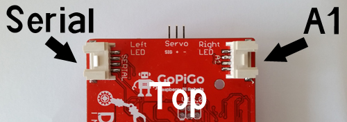

# Program the GoPiGo in Scratch

You can program the GoPiGo in Scratch.  This repo contains support programs and example programs to help you program the [GoPiGo](http://www.dexterindustries.com/GoPiGo) in Scratch.

The GoPiGo is a delightful and complete robot for the Raspberry Pi that turns your Pi into a fully operating robot.  GoPiGo is a mobile robotic platform for the Raspberry Pi developed by [Dexter Industries.](http://www.dexterindustries.com/GoPiGo).

## Sensor Placement
You can add a number of Grove sensors to the GoPiGo.  Sensors must be placed in the correct port to work.

 	
| Sensor | Port |
| ------------- | ------------- |
| Ultrasonic | A1 |
| Button | A1 or D11 |
| Sound Sensor | A1 |
| Buzzer | D11 |
| LED | D11 |
| Motion Sensor | D11|
| Infrared Receiver	| A1 |
| Line Sensor | I2C |

## See Also

- [Dexter Industries] (http://www.dexterindustries.com/GoPiGo)
- [Kickstarter Campaign] (http://kck.st/Q6vVOP)
- [Raspberry Pi] (http://www.raspberrypi.org/)

This repository contains source code, firmware and design materials for the GoPiGo.

## License
GoPiGo for the Raspberry Pi: an open source robotics platform for the Raspberry Pi.
Copyright (C) 2015  Dexter Industries

This program is free software: you can redistribute it and/or modify
it under the terms of the GNU General Public License as published by
the Free Software Foundation, either version 3 of the License, or
(at your option) any later version.

This program is distributed in the hope that it will be useful,
but WITHOUT ANY WARRANTY; without even the implied warranty of
MERCHANTABILITY or FITNESS FOR A PARTICULAR PURPOSE.  See the
GNU General Public License for more details.

You should have received a copy of the GNU General Public License
along with this program.  If not, see <http://www.gnu.org/licenses/gpl-3.0.txt>.